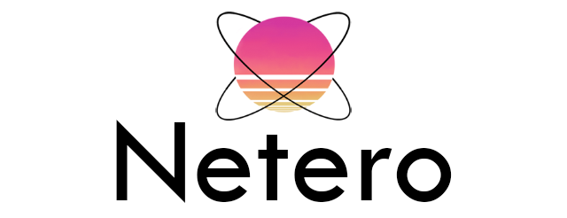

    

Netero's libs help you create applications with real-time problems, events management, and deal with shared resources.

Netero aims to expose monolithic containers and patterns working beside the STL
in the most generic way. I tried to make as much as possible Netero features supported
under Windows, linux based OS and macOs.

You can access to the documentation by clicking on the "documented" badge.
Feel free to join the dedicated discord server to chat with me.

## Core

The core containe basics standalone containers. It also provide patterns that might
be reuse in another submodules.

Containers:
 * avl: balanced binary search tree
 * shared_buffer: thread safe circular buffer
 * set: std::set with isSubsetOf and interWith feature
 * type_id: static type typeId container (needed for the ecs)
 * os: namespace containing OS helper, like userlogin, home dir path...

The core contain an Observer pattern, with the following container:
 * slot: a callback holder container (Observer)
 * signal: an event emitter container to connect with slots (Observable)

## ECS

The Ecs submodule contain an Entity Component System pattern ready to use.

Containers:
 * world: ecs context container holder
 * entity: entity container managed by a wolrd container
 * system: logic holder container for entities
 * component: attributs holder container for entities
 * component_filter: filters container base on entities's components for systems

## Audio

The audio submodule has got containers to provide fast and raw access to audio buffers.
Loopback recording devices is supported on Windows using the WASAPI.

Container:
 * engine: container exposing the specific OS implementation
 * device: container representing an audio device
 * mixer: container mixing multiple signal into one
 * renderStream: interface to be implemented by the client to render audio data
 * captureStream: interface to be implemented by the client to capture audio data
 * signals: containers ready to render signals
 * waveRecorder: container to record audio into a wave file

## Extra

The extra module contain self hosted code that does not belong to Netero, which means that it is not
covered by the Netero's license and is subject to terms and conditions fixed by theirs respective authors.
Extra is a way to redistributes this sources to other Netero's modules, while theirs license permit it.

## Graphics

 The graphics submodule provide container to perform procing on GPU usgin graphics pipelines or computes pipilines.
 It rely on the Vulkan SDK but do not redisribute it.
 In order to use this module you just need to install it, Netero's cmake macros takes care of the rest.
 This module is under active development.

